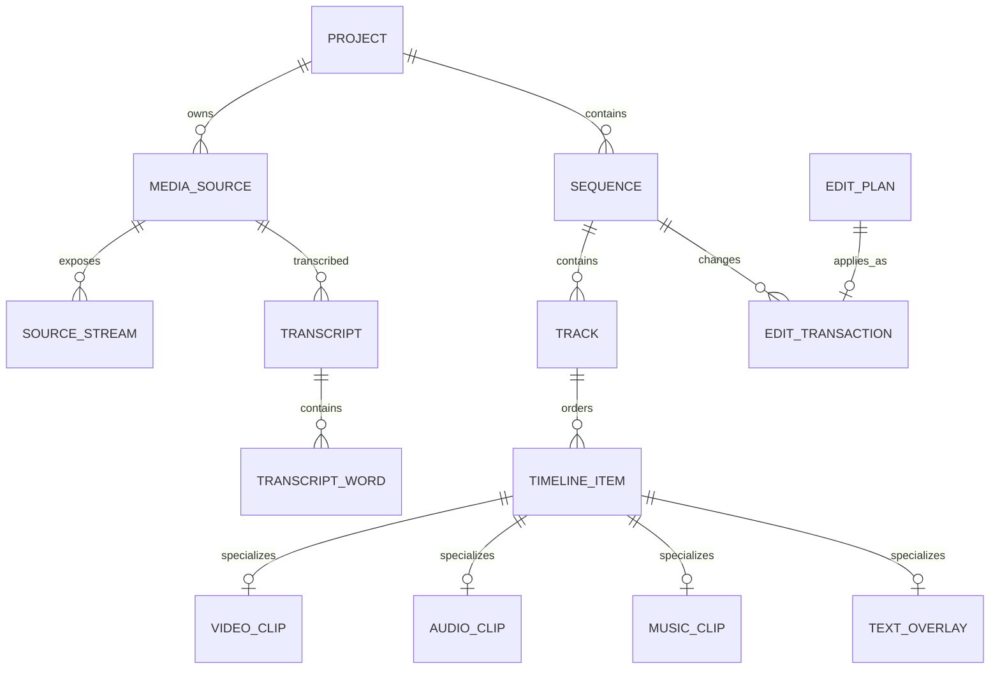
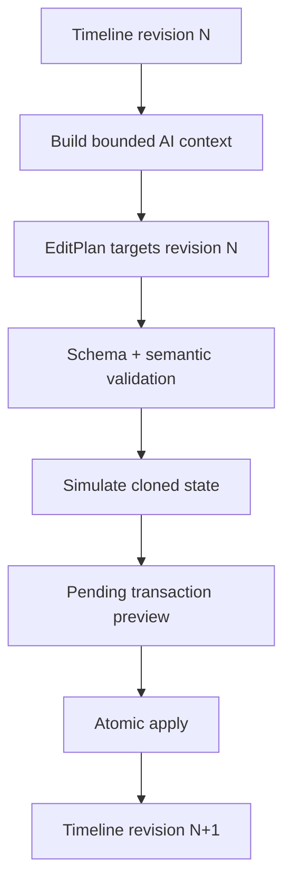

# Moataz vid — المرحلة الأولى

## Project / Timeline Data Model V1

**التطبيق:** Moataz vid  
**المالك والمطور:** معتز العلقمي — تعز، اليمن  
**الإصدار المعماري:** Data Model V1.0  
**الحالة:** مرجع تأسيسي قبل بدء الواجهات أو التنفيذ الكامل  
**النطاق:** نموذج البيانات، التخزين، العلاقات، التحقق، التاريخ، والربط مع EditPlan V1 فقط

---

## 1. الهدف والقرارات الملزمة

هذه الوثيقة تثبّت البنية الداخلية التي يصبح فوقها Editor Core، والتحليل المحلي، والذكاء الاصطناعي، والمعاينة، والتصدير. قاعدة البيانات هي مصدر الحقيقة للمشروع والـTimeline؛ ملفات الوسائط لا تُدمج داخل Room، والـLLM لا يرى مسارات الجهاز ولا يغيّر السجل مباشرة.

القرارات الأساسية:

1. **Room هو مصدر الحقيقة للبيانات المنظمة**: المشاريع، المصادر، المقاطع، التوقيتات، النص، القيود، التاريخ، والخطط.
2. **الملفات الثنائية تبقى ملفات**: الفيديو، الصوت، الموسيقى، الخطوط، الصور، الوكلاء Proxy، الموجات، الصور المصغرة، ونتائج التصدير.
3. **الزمن الداخلي `Long` بالميكروثانية (`Us`)** لتجنب أخطاء التقريب والتوافق مع Media3 وMediaCodec. عقد EditPlan V1 الخارجي يبقى بالميليثانية (`Ms`) ويُحوّل عند الحدود فقط.
4. **لا تُخزن التوقيتات كـ`Float` أو `Double`**.
5. **الـTimeline غير هدّام**: القص والحذف والسرعة والتحويل لا تعدل المصدر الأصلي.
6. **كل تعديل يمر عبر Transaction** واحدة قابلة للتراجع وإعادة التطبيق.
7. **كل خطة AI ترتبط بمراجعة Timeline محددة** لمنع تطبيق خطة على حالة تغيّرت بعد إنشائها.
8. **الكيانات تستعمل IDs معتمة مستقرة** ولا تعتمد على اسم الملف أو ترتيب القائمة.
9. **الـTimeline يستعمل تركيبًا Composition لا وراثة Room**: سجل أساسي `TimelineItemEntity` وجداول تخصصية حسب النوع.
10. **البيانات المشتقة قابلة لإعادة البناء** ولا تعامل كمصدر حقيقة.

### 1.1 أنواع الزمن

| النظام | المعنى | مثال الحقل |
|---|---|---|
| Source Time | موضع داخل ملف المصدر الأصلي | `sourceInUs`, `word.startUs` |
| Timeline Time | موضع داخل الـTimeline الحالي | `timelineStartUs` |
| Item-local Time | موضع داخل Clip بعد بدايته | `effect.startOffsetUs` |
| Output Time | زمن النتيجة بعد السرعة والتحويل | يُحسب من Speed Map |

لا يجوز مقارنة توقيتين من نظامين مختلفين قبل تحويل صريح. النطاق نصف مفتوح دائمًا: `[startUs, endUs)`، أي إن البداية مشمولة والنهاية غير مشمولة.

---

## 2. نظام المعرّفات IDs

تُستخدم ULID بطول 26 حرفًا، مسبوقة بنوع الكيان لسهولة التشخيص. تُحفظ في Room كـ`TEXT` وتبقى Opaque داخل منطق التطبيق.

| الكيان | النمط | مثال |
|---|---|---|
| Project | `prj_` | `prj_01J...` |
| Media source | `src_` | `src_01J...` |
| Source stream | `stm_` | `stm_01J...` |
| Timeline/Sequence | `seq_` | `seq_01J...` |
| Track | `trk_` | `trk_01J...` |
| Timeline item/Clip | `clp_` | `clp_01J...` |
| Caption cue | `cap_` | `cap_01J...` |
| Transcript | `trn_` | `trn_01J...` |
| Word | `wrd_` | `wrd_01J...` |
| Asset | `ast_` | `ast_01J...` |
| Effect | `efx_` | `efx_01J...` |
| Transition | `trs_` | `trs_01J...` |
| Transaction | `txn_` | `txn_01J...` |
| EditPlan | `pln_` | `pln_01J...` |
| Constraint | `cst_` | `cst_01J...` |

قواعد IDs:

- ينشئ التطبيق الـID محليًا عند إنشاء الكيان، ولا يعاد استخدامه.
- تغيير اسم المشروع أو الملف لا يغيّر الـID.
- نسخ مشروع ينشئ `projectId` جديدًا وIDs جديدة لكل الكيانات الداخلية، مع جدول Mapping مؤقت أثناء النسخ.
- لا يقبل Validator أي ID غير موجود أو تابع لمشروع آخر.

نموذج Kotlin:

```kotlin
@JvmInline value class ProjectId(val value: String)
@JvmInline value class SourceId(val value: String)
@JvmInline value class SequenceId(val value: String)
@JvmInline value class TrackId(val value: String)
@JvmInline value class ClipId(val value: String)
@JvmInline value class AssetId(val value: String)
@JvmInline value class TransactionId(val value: String)
@JvmInline value class EditPlanId(val value: String)

@JvmInline value class TimeUs(val value: Long)
@JvmInline value class DurationUs(val value: Long)
```

تُستخدم TypeConverters بين Value Classes و`String/Long` أو تبقى Entities بأنواع Room الأولية وتحوّلها طبقة Mapper إلى Domain Models.

---

## 3. الخريطة العامة للعلاقات



علاقات مهمة غير ظاهرة لتقليل ازدحام الرسم:

- `EffectInstance` يتبع `TimelineItem`، و`Keyframe` يتبع Effect أو Transform.
- `Transition` يربط Itemين متجاورين على Track واحد.
- `CaptionCue` يتبع Caption Track ويرتبط بكلمات Transcript بعلاقة many-to-many.
- `ProtectedRange` و`ProjectConstraint` يتبعان Project وقد يستهدفان Source أو Sequence أو Clip.
- `ProxyFile` يتبع MediaSource ونسخة إعداد Proxy.

---

## 4. Project

### الحقول

| الحقل | النوع | الوصف |
|---|---|---|
| `projectId` | `String` | المفتاح الأساسي |
| `title` | `String` | اسم المشروع، 1–200 حرف |
| `description` | `String?` | وصف اختياري |
| `createdAtEpochMs` | `Long` | وقت الإنشاء UTC |
| `updatedAtEpochMs` | `Long` | آخر تغيير محفوظ |
| `lastOpenedAtEpochMs` | `Long?` | آخر فتح |
| `activeSequenceId` | `String?` | الـTimeline النشط |
| `timelineRevision` | `Long` | يزيد بعد كل Transaction مطبقة |
| `schemaVersion` | `String` | إصدار حزمة المشروع، مثل `1.0.0` |
| `roomSchemaVersion` | `Int` | للعرض التشخيصي فقط؛ Room يملك نسخته الفعلية |
| `status` | enum | `ACTIVE`, `ARCHIVED`, `RECOVERY_REQUIRED` |
| `thumbnailAssetId` | `String?` | غلاف المشروع |
| `defaultExportPresetId` | `String?` | إعداد التصدير الافتراضي |
| `privacyLevel` | enum | `LOCAL_ONLY`, `TEXT_AI`, `VISION_AI`, `CLOUD_MEDIA` |
| `rowRevision` | `Long` | optimistic concurrency داخل التطبيق |

### العلاقات والتخزين

- Project واحد يملك مصادر متعددة وSequences متعددة وConstraints وHistory.
- يحفظ السجل والحقول المنظمة في Room.
- صورة الغلاف ملف Asset؛ لا تحفظ Blob داخل Project.
- مدة المشروع ودقته ووجود Transcript/Music **قيم محسوبة** من الـSequence النشط ولا تخزن كحقائق مكررة. يمكن Cache لها مع `computedForRevision`.

```kotlin
data class Project(
    val id: ProjectId,
    val title: String,
    val description: String?,
    val createdAtEpochMs: Long,
    val updatedAtEpochMs: Long,
    val activeSequenceId: SequenceId?,
    val timelineRevision: Long,
    val schemaVersion: ProjectSchemaVersion,
    val status: ProjectStatus,
    val thumbnailAssetId: AssetId?,
    val privacyLevel: PrivacyLevel,
    val rowRevision: Long,
)
```

### التحقق

- `activeSequenceId` يجب أن يتبع المشروع نفسه.
- لا تنقص `timelineRevision` إلا عند استعادة نسخة Backup كاملة.
- لا يسمح بحالة `ACTIVE` إذا كانت Migration ناقصة.

---

## 5. Media Sources وSource Streams

`MediaSource` يمثل ملفًا أصليًا أو نسخة مدارة، ولا يمثل وجوده على Timeline. يمكن استعمال المصدر عدة مرات في مقاطع مختلفة.

### MediaSource

| الحقل | النوع | الوصف |
|---|---|---|
| `sourceId` | `String` | PK |
| `projectId` | `String` | FK |
| `kind` | enum | `VIDEO`, `AUDIO`, `IMAGE`, `GENERATED` |
| `displayName` | `String` | اسم العرض فقط |
| `fileRefId` | `String` | مرجع الملف، لا raw path |
| `importMode` | enum | `LINKED_SAF`, `MANAGED_COPY`, `GENERATED` |
| `mimeType` | `String` | MIME موثوق بعد الفحص |
| `durationUs` | `Long?` | null للصور الثابتة |
| `width`, `height` | `Int?` | أبعاد coded pixels |
| `rotationDegrees` | `Int` | `0/90/180/270` |
| `displayWidth`, `displayHeight` | `Int?` | الأبعاد بعد الدوران/SAR |
| `frameRateNum`, `frameRateDen` | `Int?` | معدل Rational لا Float |
| `pixelAspectNum`, `pixelAspectDen` | `Int` | افتراضي `1/1` |
| `colorSpace` | enum | `SDR_BT709`, `HDR10`, `HLG`, `UNKNOWN` |
| `audioChannelCount` | `Int?` | ملخص، والتفصيل في Streams |
| `sampleRateHz` | `Int?` | ملخص |
| `sizeBytes` | `Long` | الحجم وقت الاستيراد |
| `contentHash` | `String?` | SHA-256 عند توفره |
| `quickFingerprint` | `String` | size + mtime + sampled hash |
| `availability` | enum | `AVAILABLE`, `MISSING`, `PERMISSION_LOST`, `CHANGED` |
| `metadataVersion` | `Int` | إصدار extractor |
| `createdAtEpochMs` | `Long` | وقت الإدخال |

### SourceStream

يمثل Track داخل الحاوية: فيديو، صوت، أو Subtitle.

| الحقل | النوع |
|---|---|
| `streamId` PK | `String` |
| `sourceId` FK | `String` |
| `streamIndex` | `Int` |
| `streamType` | `VIDEO/AUDIO/SUBTITLE` |
| `codecMime` | `String` |
| `languageTag` | `String?` |
| `channelCount`, `sampleRateHz`, `bitrate` | `Int?` |
| `isDefault` | `Boolean` |
| `metadataJson` | JSON محدود ومُصدر من extractor فقط |

```kotlin
data class MediaSource(
    val id: SourceId,
    val projectId: ProjectId,
    val kind: MediaKind,
    val displayName: String,
    val fileRef: FileRefId,
    val importMode: ImportMode,
    val duration: DurationUs?,
    val dimensions: PixelSize?,
    val rotationDegrees: Int,
    val frameRate: Rational?,
    val colorSpace: SourceColorSpace,
    val fingerprint: SourceFingerprint,
    val availability: SourceAvailability,
)
```

### ما يُحفظ وأين

- Metadata ومرجع الملف في Room.
- المصدر الأصلي يبقى عبر SAF أو يُنسخ إلى `projects/{projectId}/sources/` عند اختيار Managed Copy.
- thumbnails، waveform، scene index، وframe index ملفات مشتقة.
- مدة العرض بعد القص والسرعة قيمة مؤقتة وليست في MediaSource.

### التحقق

- `durationUs > 0` للفيديو والصوت.
- Rotation من القيم الأربع فقط.
- `frameRateNum > 0 && frameRateDen > 0`.
- عند تغير fingerprint يصبح المصدر `CHANGED` وتُبطل التحليلات والوكلاء المرتبطون به قبل الاستخدام.

---

## 6. FileReference وAssets وProxy Files

### FileReference

طبقة عزل بين البيانات ومسارات Android.

| الحقل | النوع | الملاحظة |
|---|---|---|
| `fileRefId` | `String` PK | مرجع داخلي |
| `storageKind` | enum | `SAF_URI`, `APP_PRIVATE`, `MEDIASTORE`, `TEMP_CACHE` |
| `uriString` | `String?` | SAF/MediaStore؛ لا يُرسل للـAI |
| `managedRelativePath` | `String?` | مسار نسبي تحت جذر المشروع |
| `persistedPermission` | `Boolean` | خاص بـSAF |
| `mimeType`, `sizeBytes`, `modifiedAtEpochMs` | قيم metadata |
| `hashSha256` | `String?` | للتحقق وإزالة التكرار |
| `availability` | enum | حالة الوصول |

### Asset

يشمل الموسيقى المستوردة، SFX، الصور، الملصقات، الخطوط، LUT، قوالب النص، أو ملفات مولدة.

| الحقل | النوع |
|---|---|
| `assetId` | `String` PK |
| `projectId` | `String?`؛ null لمكتبة التطبيق المشتركة |
| `assetType` | `MUSIC/SFX/IMAGE/STICKER/FONT/LUT/TEXT_STYLE/OTHER` |
| `name` | `String` |
| `fileRefId` | `String?` |
| `durationUs`, `width`, `height` | nullable حسب النوع |
| `licenseType` | `OWNED/MIT/CC/PREMIUM/UNKNOWN` |
| `licenseTextRefId` | `String?` |
| `attribution` | `String?` |
| `contentHash` | `String?` |
| `metadataJson` | JSON typed by `assetType` |
| `isAvailable` | `Boolean` |

### ProxyFile

| الحقل | النوع |
|---|---|
| `proxyId` | `String` PK |
| `sourceId` | `String` FK |
| `fileRefId` | `String` FK |
| `presetId` | `String` |
| `width`, `height`, `bitrate`, `codecMime` | القيم الفعلية |
| `status` | `QUEUED/BUILDING/READY/FAILED/STALE` |
| `progressPermille` | `Int` من 0 إلى 1000 |
| `sourceFingerprint` | `String` |
| `generatedAtEpochMs` | `Long?` |
| `errorCode` | `String?` |

```kotlin
data class Asset(
    val id: AssetId,
    val projectId: ProjectId?,
    val type: AssetType,
    val name: String,
    val fileRefId: FileRefId?,
    val license: AssetLicense,
    val metadata: AssetMetadata,
)

data class ProxyFile(
    val id: ProxyId,
    val sourceId: SourceId,
    val fileRefId: FileRefId,
    val presetId: String,
    val status: ProxyStatus,
    val sourceFingerprint: String,
)
```

قواعد الملفات:

- لا يحفظ Room أي فيديو أو صورة أو صوت كـBLOB.
- `APP_PRIVATE` يخزن مسارًا نسبيًا فقط؛ الجذر يقرره FileRepository.
- ملفات `TEMP_CACHE` يمكن حذفها وإعادة بنائها ولا تدخل Backup.
- لا يُستخدم Proxy إذا اختلف `sourceFingerprint` أو إعداد preset.

---

## 7. Timeline / Sequence

يسمى كيان Timeline في التخزين `Sequence` حتى يمكن للمشروع امتلاك أكثر من نسخة أو Cut.

| الحقل | النوع |
|---|---|
| `sequenceId` | `String` PK |
| `projectId` | `String` FK |
| `name` | `String` |
| `canvasWidth`, `canvasHeight` | `Int` |
| `frameRateNum`, `frameRateDen` | `Int` |
| `backgroundColorArgb` | `Long` |
| `audioSampleRateHz` | `Int` |
| `durationMode` | `AUTO/FIXED` |
| `fixedDurationUs` | `Long?` |
| `revision` | `Long` |
| `createdAtEpochMs`, `updatedAtEpochMs` | `Long` |

المدة في وضع `AUTO`:

```text
max(item.timelineStartUs + item.timelineDurationUs)
```

ولا تشمل العناصر المعطلة. في وضع `FIXED` يمنع أي Item من تجاوز النهاية إلا بسياسة واضحة للقص.

```kotlin
data class Sequence(
    val id: SequenceId,
    val projectId: ProjectId,
    val name: String,
    val canvas: PixelSize,
    val frameRate: Rational,
    val backgroundArgb: Long,
    val audioSampleRateHz: Int,
    val durationMode: DurationMode,
    val fixedDuration: DurationUs?,
    val revision: Long,
)
```

التحقق: الأبعاد موجبة وضمن قدرة الجهاز، FPS Rational موجب، و`fixedDurationUs > 0` عند الوضع الثابت.

---

## 8. Tracks

| الحقل | النوع | الوصف |
|---|---|---|
| `trackId` | `String` PK | المعرّف |
| `sequenceId` | `String` FK | المالك |
| `type` | enum | `VIDEO`, `AUDIO`, `MUSIC`, `CAPTION`, `OVERLAY` |
| `name` | `String` | اسم العرض |
| `orderIndex` | `Int` | ترتيب الطبقات |
| `collisionPolicy` | enum | `NO_OVERLAP`, `ALLOW_OVERLAP`, `STACK` |
| `isMuted`, `isHidden`, `isLocked` | `Boolean` | تحكم Track |
| `volumeDb` | `Float` | للصوت فقط، قيمة dB محدودة |
| `blendMode` | enum | لمسارات الصورة/Overlay |
| `createdAtEpochMs` | `Long` | الإنشاء |

```kotlin
data class Track(
    val id: TrackId,
    val sequenceId: SequenceId,
    val type: TrackType,
    val name: String,
    val orderIndex: Int,
    val collisionPolicy: CollisionPolicy,
    val locked: Boolean,
    val muted: Boolean,
    val hidden: Boolean,
)
```

قواعد التحقق:

- `orderIndex` فريد داخل `(sequenceId, type)` أو يعاد ترقيمه داخل Transaction.
- VideoClip لا يدخل Track صوت، وCaptionCue لا يدخل Track فيديو.
- Track المقفول يمنع الإضافة والحذف وإعادة الترتيب والتعديل على عناصره.
- `NO_OVERLAP` يمنع تقاطع النطاقات بعد المحاكاة.

---

## 9. TimelineItem: الأساس المشترك لكل Clip

### TimelineItemEntity

| الحقل | النوع | الوصف |
|---|---|---|
| `itemId` | `String` PK | Clip ID العام |
| `projectId` | `String` FK | لسلامة العزل والاستعلام |
| `sequenceId` | `String` FK | الـTimeline |
| `trackId` | `String` FK | المسار |
| `itemType` | enum | `VIDEO/AUDIO/MUSIC/TEXT/IMAGE` |
| `timelineStartUs` | `Long` | موضع البداية |
| `timelineDurationUs` | `Long` | مدة الناتج بعد Speed Map |
| `sourceInUs` | `Long?` | بداية المصدر |
| `sourceOutUs` | `Long?` | نهاية المصدر |
| `zIndex` | `Int` | ترتيب داخل Track المتراكب |
| `enabled` | `Boolean` | مستعمل في العرض والتصدير |
| `locked` | `Boolean` | قفل المستخدم |
| `lockReason` | `String?` | سبب القفل |
| `groupId` | `String?` | تجميع UI/تحريك مشترك |
| `linkGroupId` | `String?` | ربط فيديو بصوت دون دمجهما |
| `label`, `colorTagArgb` | اختيارية | تنظيم المستخدم |
| `createdAtEpochMs`, `updatedAtEpochMs` | `Long` | auditing |
| `rowRevision` | `Long` | optimistic concurrency |

`timelineDurationUs` تخزن لتسريع الاستعلام، لكنها يجب أن تطابق القيمة المحسوبة من `(sourceOutUs-sourceInUs)` وSpeed Map. Validator يعيد حسابها في كل Transaction.

```kotlin
sealed interface TimelineItem {
    val id: ClipId
    val sequenceId: SequenceId
    val trackId: TrackId
    val timelineStart: TimeUs
    val timelineDuration: DurationUs
    val enabled: Boolean
    val locked: Boolean
}

data class SourceWindow(
    val sourceIn: TimeUs,
    val sourceOutExclusive: TimeUs,
)
```

قواعد عامة:

- البداية `>= 0` والمدة `>= minimumItemDurationUs`؛ الافتراضي 50ms، ويمكن رفعه حسب النوع.
- `sourceInUs >= 0 && sourceOutUs > sourceInUs` ولا تتجاوز مدة المصدر.
- Item وTrack وSequence وSource يجب أن تنتمي إلى Project نفسه.
- لا يعدل Item مقفول أو Item داخل Track مقفول، حتى بواسطة AI.

---

## 10. Video Clips وImage Clips

### VideoClipEntity

| الحقل | النوع |
|---|---|
| `itemId` | PK/FK إلى TimelineItem |
| `sourceId` | FK إلى MediaSource |
| `videoStreamId` | FK إلى SourceStream |
| `linkedAudioItemId` | `String?` |
| `freezeFrameAtSourceUs` | `Long?` |
| `opacity` | `Float` بين 0 و1 |
| `blendMode` | enum |
| `transformId` | FK |
| `colorAdjustmentId` | FK nullable |
| `stabilizationMode` | `OFF/AUTO`، مؤجل التنفيذ |

```kotlin
data class VideoClip(
    override val id: ClipId,
    override val sequenceId: SequenceId,
    override val trackId: TrackId,
    override val timelineStart: TimeUs,
    override val timelineDuration: DurationUs,
    override val enabled: Boolean,
    override val locked: Boolean,
    val sourceId: SourceId,
    val streamId: StreamId,
    val sourceWindow: SourceWindow,
    val opacity: Float,
    val transform: Transform,
    val speedMap: SpeedMap,
) : TimelineItem
```

Image Clip يستخدم `TimelineItem.itemType=IMAGE` وجدول `ImageClipEntity` يحوي `assetId/sourceId`, و`holdDurationUs` تأتي من TimelineItem؛ لا يملك source range زمنيًا.

---

## 11. Audio Clips والموسيقى

### AudioClipEntity

| الحقل | النوع |
|---|---|
| `itemId` | PK/FK |
| `sourceId` | `String?` |
| `assetId` | `String?` |
| `audioStreamId` | `String?` |
| `role` | `DIALOGUE/AMBIENCE/SFX/VOICE_OVER/MUSIC` |
| `gainDb` | `Float` |
| `pan` | `Float` من -1 إلى 1 |
| `muted` | `Boolean` |
| `preservePitch` | `Boolean` |
| `fadeInUs`, `fadeOutUs` | `Long` |
| `channelMode` | `STEREO/MONO/LEFT/RIGHT` |

بالضبط واحد من `sourceId` أو `assetId` يجب أن يكون غير null.

### MusicClipEntity

تخصص إضافي عندما `role=MUSIC`:

| الحقل | النوع |
|---|---|
| `itemId` | PK/FK إلى AudioClip |
| `loopMode` | `NONE/LOOP_TO_ITEM_END` |
| `loopCrossfadeUs` | `Long` |
| `duckingEnabled` | `Boolean` |
| `duckTargetRole` | غالبًا `DIALOGUE` |
| `duckAmountDb` | `Float` سالب أو صفر |
| `attackUs`, `releaseUs` | `Long` |

```kotlin
data class AudioClip(
    override val id: ClipId,
    override val sequenceId: SequenceId,
    override val trackId: TrackId,
    override val timelineStart: TimeUs,
    override val timelineDuration: DurationUs,
    override val enabled: Boolean,
    override val locked: Boolean,
    val origin: AudioOrigin,
    val sourceWindow: SourceWindow?,
    val role: AudioRole,
    val gainDb: Float,
    val pan: Float,
    val preservePitch: Boolean,
    val fades: AudioFades,
    val speedMap: SpeedMap,
) : TimelineItem

sealed interface AudioOrigin {
    data class Source(val sourceId: SourceId, val streamId: StreamId) : AudioOrigin
    data class Asset(val assetId: AssetId) : AudioOrigin
}
```

التحقق:

- Gain ضمن `[-60dB, +24dB]` في V1.
- fade in + fade out لا يتجاوزان مدة العنصر إلا بسياسة crossfade معتمدة.
- `duckAmountDb` ضمن `[-30, 0]`.
- سرعة الصوت ضمن النطاق المدعوم، و`preservePitch=true` يتطلب processor متاحًا وإلا تفشل المحاكاة مبكرًا.

---

## 12. Speed وTime Mapping

لا يُخزن `speed` كحقل وحيد لأن V1 يحتاج سرعة ثابتة، بينما الأساس يجب أن يدعم ramp لاحقًا. يستعمل `SpeedSegmentEntity`:

| الحقل | النوع |
|---|---|
| `speedSegmentId` | PK |
| `itemId` | FK |
| `orderIndex` | `Int` |
| `sourceStartOffsetUs`, `sourceEndOffsetUs` | نطاق داخل نافذة المصدر |
| `speedStart`, `speedEnd` | `Double` |
| `interpolation` | `CONSTANT/LINEAR` |

في V1 ينشئ `CHANGE_SPEED` Segment واحدًا `CONSTANT` يغطي المصدر كاملًا.

```kotlin
data class SpeedSegment(
    val sourceRange: TimeRangeUs,
    val speedStart: Double,
    val speedEnd: Double,
    val interpolation: SpeedInterpolation,
)

data class SpeedMap(val segments: List<SpeedSegment>) {
    fun sourceOffsetToTimelineOffset(sourceOffset: TimeUs): TimeUs
    fun timelineOffsetToSourceOffset(timelineOffset: TimeUs): TimeUs
}
```

قواعد التحقق:

- V1: `0.25 <= speed <= 4.0`؛ يتغير النطاق فقط بقدرة المحرك.
- Segments مرتبة، متجاورة بلا gap أو overlap، وتغطي نافذة المصدر كاملة.
- يحسب الناتج بتكامل `1/speed`؛ التقريب يكون مرة واحدة إلى أقرب microsecond.
- أي تغيير سرعة يعيد ربط captions/effects المعتمدة على المصدر ويشغّل فحص الانحراف.

---

## 13. Crop / Transform

`TransformEntity` سجل 1:1 مع Video/Image/Text Item:

| الحقل | النوع |
|---|---|
| `transformId` | PK |
| `itemId` | FK unique |
| `positionXNorm`, `positionYNorm` | `Float`، مركز normalized canvas |
| `scaleX`, `scaleY` | `Float` موجب |
| `rotationDegrees` | `Float` |
| `anchorXNorm`, `anchorYNorm` | `Float` |
| `cropLeft/Top/Right/BottomNorm` | `Float` من 0 إلى 1 |
| `cropMode` | `FIT/FILL/FREE` |
| `targetAspectNum/Den` | `Int?` |
| `mirrorX`, `mirrorY` | `Boolean` |

```kotlin
data class Transform(
    val position: NormalizedPoint,
    val scaleX: Float,
    val scaleY: Float,
    val rotationDegrees: Float,
    val anchor: NormalizedPoint,
    val crop: NormalizedRect,
    val cropMode: CropMode,
    val targetAspect: Rational?,
    val mirrorX: Boolean,
    val mirrorY: Boolean,
)
```

- المستطيل يحقق `0 <= left < right <= 1` و`0 <= top < bottom <= 1`.
- Scale أكبر من صفر وتُحدد حدود عملية، مثل `0.01..20`.
- `SET_CROP 9:16 FILL` يحوّل إلى Transform محسوب؛ يحتفظ التطبيق بالـintent الأصلي في Transaction، وبالقيم المحسوبة في Transform.
- Dynamic Reframe لاحقًا يستعمل Keyframes ولا يغير هذا العقد.

---

## 14. Text / Overlays

### TextOverlayEntity

| الحقل | النوع |
|---|---|
| `itemId` | PK/FK TimelineItem |
| `text` | `String` |
| `styleId` | FK إلى TextStyleAsset |
| `fontAssetId` | `String?` |
| `fontSizeSp` | `Float` |
| `textColorArgb`, `backgroundColorArgb` | `Long` |
| `alignment` | enum |
| `maxWidthNorm` | `Float` |
| `safeAreaPolicy` | `NONE/ACTION_SAFE/CAPTION_SAFE` |
| `transformId` | FK |
| `animationInPreset`, `animationOutPreset` | `String?` |

```kotlin
data class TextOverlay(
    override val id: ClipId,
    override val sequenceId: SequenceId,
    override val trackId: TrackId,
    override val timelineStart: TimeUs,
    override val timelineDuration: DurationUs,
    override val enabled: Boolean,
    override val locked: Boolean,
    val text: String,
    val styleId: String,
    val transform: Transform,
    val safeAreaPolicy: SafeAreaPolicy,
) : TimelineItem
```

النص والخصائص المنظمة في Room؛ الخطوط والصور والملصقات ملفات Assets. Layout النهائي وglyph cache مؤقتان.

---

## 15. Captions

Captions ليست Text Overlays عادية؛ لها Track وCues وعلاقة مع transcript، ثم تتحول وقت العرض إلى عناصر Render محسوبة.

### CaptionStyleEntity

`styleId`, الاسم، font asset، الألوان، stroke/shadow، position، margins، `wordsPerChunk`, max lines، animation، safe area.

### CaptionCueEntity

| الحقل | النوع |
|---|---|
| `cueId` | PK |
| `trackId`, `sequenceId` | FK |
| `timelineStartUs`, `timelineEndUs` | زمن العرض |
| `text` | النص النهائي القابل للتصحيح |
| `styleId` | FK |
| `sourceType` | `TRANSCRIPT/MANUAL/IMPORTED` |
| `transcriptId` | `String?` |
| `languageTag` | `String?` |
| `speakerId` | `String?` |
| `isUserEdited` | `Boolean` |
| `alignmentStatus` | `ALIGNED/STALE/MANUAL` |

### CaptionCueWordRefEntity

جدول وصل: `cueId`, `wordId`, `orderIndex`. يحافظ على الأصل اللغوي حتى إذا عدل المستخدم نص Cue؛ `isUserEdited` يمنع الكتابة فوق التصحيح تلقائيًا.

```kotlin
data class CaptionCue(
    val id: CaptionCueId,
    val trackId: TrackId,
    val range: TimeRangeUs,
    val text: String,
    val styleId: String,
    val source: CaptionSource,
    val linkedWordIds: List<WordId>,
    val userEdited: Boolean,
    val alignmentStatus: CaptionAlignmentStatus,
)
```

التحقق:

- `start < end`، ولا Cue خارج Sequence.
- ترتيب الكلمات داخل Cue متصاعد في source time.
- Caption Track يمكن أن يمنع overlap افتراضيًا.
- حذف Clip يزيل أو يعيد توزيع Cues التابعة له داخل Transaction نفسها؛ لا تترك Captions يتيمة.

---

## 16. Transcript وربط الكلمات والتوقيت

Transcript مرتبط بـMediaSource وليس Clip، لذلك يبقى صالحًا عند إعادة ترتيب المقاطع. التوقيت دائمًا Source Time.

### TranscriptEntity

| الحقل | النوع |
|---|---|
| `transcriptId` | PK |
| `sourceId`, `streamId` | FK |
| `languageTag` | BCP-47 |
| `engine` | `WHISPER_LOCAL/PROVIDER/...` |
| `modelId`, `modelVersion` | `String` |
| `status` | `PENDING/RUNNING/READY/FAILED/STALE` |
| `sourceFingerprint` | `String` |
| `createdAtEpochMs` | `Long` |
| `revision` | `Long` |

### TranscriptSegmentEntity

`segmentId`, `transcriptId`, `startUs`, `endUs`, `text`, `speakerId?`, `confidence?`, `orderIndex`.

### TranscriptWordEntity

| الحقل | النوع |
|---|---|
| `wordId` | PK |
| `transcriptId`, `segmentId` | FK |
| `orderIndex` | `Int` |
| `startUs`, `endUs` | Source Time |
| `surface` | النص الظاهر |
| `normalized` | للبحث |
| `confidence` | `Float?` 0..1 |
| `speakerId` | `String?` |
| `flags` | bitset: filler, punctuation, uncertain... |

```kotlin
data class TranscriptWord(
    val id: WordId,
    val transcriptId: TranscriptId,
    val segmentId: SegmentId,
    val orderIndex: Int,
    val sourceRange: TimeRangeUs,
    val surface: String,
    val normalized: String,
    val confidence: Float?,
    val speakerId: String?,
    val flags: Set<WordFlag>,
)
```

الفهارس المطلوبة:

- `(transcriptId, orderIndex)` unique.
- `(sourceId, startUs, endUs)` عبر join أو denormalized sourceId عند الحاجة للأداء.
- FTS5 على `surface` و`normalized` مع row mapping إلى `wordId/segmentId`.

Packed Transcript **يحسب مؤقتًا** من الكلمات/Segments حسب النطاق المطلوب ولا يخزن كنسخة حقيقة. يمكن Cache مشروطًا بـ`transcriptRevision`.

التحقق: كلمات مرتبة، `start < end`، ضمن مدة المصدر، وعدم overlap غير المنطقي وفق سماحية extractor. تغير fingerprint يجعل Transcript `STALE`.

---

## 17. Effects وKeyframes وColor

### EffectInstanceEntity

| الحقل | النوع |
|---|---|
| `effectId` | PK |
| `itemId` | FK |
| `effectType` | Registry key مثل `color.adjustment` |
| `parameterSchemaVersion` | `Int` |
| `startOffsetUs`, `endOffsetUs` | Item-local Time |
| `enabled` | `Boolean` |
| `orderIndex` | `Int` |
| `parametersJson` | JSON canonical validated against local registry |

### KeyframeEntity

`keyframeId`, `ownerType`, `ownerId`, `parameterKey`, `offsetUs`, `valueJson`, `interpolation`, `inTangent`, `outTangent`.

```kotlin
data class EffectInstance(
    val id: EffectId,
    val itemId: ClipId,
    val type: EffectType,
    val rangeInItem: TimeRangeUs,
    val enabled: Boolean,
    val parameters: EffectParameters,
    val keyframes: List<Keyframe>,
)
```

`APPLY_COLOR_ADJUSTMENT` ينتج Effect من نوع معروف، لا حقولًا عشوائية على Clip. JSON مقبول هنا للتوسع فقط، لكنه يمر عبر Effect Registry محلي يحدد الحقول والأنواع والحدود. أي Effect مجهول يبقى محفوظًا عند فتح نسخة أحدث بوضع disabled/unsupported ولا ينفذ.

---

## 18. Transitions

| الحقل | النوع |
|---|---|
| `transitionId` | PK |
| `trackId` | FK |
| `outgoingItemId`, `incomingItemId` | FK |
| `type` | `CUT/CROSSFADE/DIP_TO_COLOR/...` |
| `durationUs` | `Long` |
| `alignment` | `CENTERED/START_AT_CUT/END_AT_CUT` |
| `parametersJson` | validated typed parameters |

```kotlin
data class Transition(
    val id: TransitionId,
    val trackId: TrackId,
    val outgoingItemId: ClipId,
    val incomingItemId: ClipId,
    val type: TransitionType,
    val duration: DurationUs,
    val alignment: TransitionAlignment,
)
```

التحقق:

- العنصران على Track واحد ومتجاوران منطقيًا.
- كلاهما غير مقفول عند إنشاء/تعديل Transition.
- توجد handles كافية من المصدر على الجانبين؛ وإلا يقصر Validator المدة فقط إذا سمحت السياسة وظهرت النتيجة في Preview.
- لا تتجاوز Transition أقصر Clip أو الحدود التي يعلنها Render Engine.

---

## 19. AI Metadata

الهدف حفظ نتائج التحليل المحلية/السحابية بصورة قابلة للإبطال، دون تلويث الكيانات الأساسية.

### AiAnalysisEntity

| الحقل | النوع |
|---|---|
| `analysisId` | PK |
| `projectId` | FK |
| `subjectType` | `SOURCE/CLIP/RANGE/SEQUENCE` |
| `subjectId` | `String` |
| `analysisType` | `SILENCE/AUDIO_QUALITY/SCENE/DUPLICATE/TAKE_SCORE/HOOK/...` |
| `sourceStartUs`, `sourceEndUs` | nullable |
| `score`, `confidence` | `Float?` |
| `provider`, `modelId`, `modelVersion` | provenance |
| `analyzerVersion` | `Int` |
| `inputFingerprint` | hash للمصدر+الإعدادات |
| `payloadJson` | schema حسب `analysisType` |
| `createdAtEpochMs`, `expiresAtEpochMs` | `Long` |
| `privacyLevelUsed` | enum |

```kotlin
data class AiAnalysis<T : AiPayload>(
    val id: AnalysisId,
    val subject: AnalysisSubject,
    val type: AnalysisType,
    val confidence: Float?,
    val provenance: AiProvenance,
    val inputFingerprint: String,
    val payload: T,
)
```

- Metadata في Room؛ الصور المصغرة/embeddings الكبيرة ملفات مشتقة مشفرة عند الحاجة، مع FileRef.
- Candidate scores تحسب أو تخزن Cache مع fingerprint.
- لا تصبح أي نتيجة AI تعديلًا إلا عبر EditPlan + Transaction.
- لا تُرسل `uriString`, `managedRelativePath`, hashes الحساسة، أو بيانات غير مطلوبة إلى النموذج.

---

## 20. Protected Ranges وLocked Clips

### ProtectedRangeEntity

| الحقل | النوع |
|---|---|
| `protectedRangeId` | PK |
| `projectId` | FK |
| `scope` | `SOURCE/SEQUENCE` |
| `sourceId` أو `sequenceId` | واحد فقط حسب scope |
| `startUs`, `endUs` | النطاق |
| `protection` | bitset: `NO_DELETE/NO_TRIM/NO_MOVE/NO_SPEED_CHANGE/NO_AUDIO_CHANGE` |
| `reason` | `String` |
| `createdBy` | `USER/POLICY/IMPORT` |
| `createdAtEpochMs` | `Long` |
| `enabled` | `Boolean` |

الأفضل حفظ حماية المحتوى في Source Time لأنها تبقى ثابتة عند تحريك Clips. حماية موضع بعينه على Timeline تستخدم `SEQUENCE` فقط عندما يكون قصد المستخدم متعلقًا بالموضع لا بالمحتوى.

### Clip Lock

الحالة الفعالة للقفل:

```text
item.locked || track.locked || projectReadOnly
```

```kotlin
data class ProtectedRange(
    val id: ProtectedRangeId,
    val projectId: ProjectId,
    val target: ProtectedTarget,
    val range: TimeRangeUs,
    val protections: Set<ProtectionKind>,
    val reason: String,
    val createdBy: ConstraintAuthor,
    val enabled: Boolean,
)
```

أي Operation تقطع نطاقًا محميًا تفشل Semantic Validation، ولا يكفي Warning. Snap إلى حدود كلمة لا يسمح له بتجاوز Protected Range.

---

## 21. Project Constraints

Constraints أوسع من ProtectedRange وتبقى عبر جلسات المحادثة.

### ProjectConstraintEntity

| الحقل | النوع |
|---|---|
| `constraintId` | PK |
| `projectId` | FK |
| `type` | `TARGET_ASPECT_RATIO`, `NO_MUSIC`, `PRESERVE_LOGO`, `MAX_DURATION`, `LANGUAGE`, `CUSTOM` |
| `priority` | `HARD/SOFT/PREFERENCE` |
| `payloadJson` | schema typed by type |
| `naturalLanguageSummary` | `String` للعرض فقط |
| `source` | `USER/PRESET/POLICY` |
| `enabled` | `Boolean` |
| `createdAtEpochMs`, `updatedAtEpochMs` | `Long` |

```kotlin
sealed interface ProjectConstraint {
    val id: ConstraintId
    val priority: ConstraintPriority

    data class TargetAspectRatio(/* ... */) : ProjectConstraint
    data class NoMusic(/* ... */) : ProjectConstraint
    data class PreserveLogo(/* ... */) : ProjectConstraint
    data class MaxDuration(/* ... */) : ProjectConstraint
}
```

Hard constraint يمنع الخطة؛ Soft يولد warning ويتطلب موافقة؛ Preference توجه Planner ولا تمنع التنفيذ. `CUSTOM` لا ينفذ مباشرة إلا إذا سجله Constraint Registry محلي.

---

## 22. Edit History وUndo/Redo

تاريخ التعديل Transaction log غير قابل للتغيير، مع Inverse Operations وSnapshots دورية.

### EditTransactionEntity

| الحقل | النوع |
|---|---|
| `transactionId` | PK |
| `projectId`, `sequenceId` | FK |
| `parentTransactionId` | FK nullable |
| `branchId` | `String` |
| `baseRevision`, `resultRevision` | `Long` |
| `origin` | `MANUAL/AI/IMPORT/MIGRATION/SYSTEM` |
| `title`, `summary` | `String` |
| `editPlanId` | FK nullable |
| `beforeTimelineHash`, `afterTimelineHash` | `String` |
| `createdAtEpochMs` | `Long` |
| `status` | `COMMITTED/FAILED/COMPACTED` |

### EditOperationEntity

`operationId`, `transactionId`, `orderIndex`, `operationType`, `forwardPayloadJson`, `inversePayloadJson`, `affectedEntityIdsJson`, `schemaVersion`.

### HistoryCursorEntity

سجل واحد لكل Sequence: `sequenceId`, `currentTransactionId`, `activeBranchId`, `updatedAtEpochMs`.

### TimelineSnapshotEntity

`snapshotId`, `sequenceId`, `transactionId`, `revision`, `fileRefId` أو `compressedPayload`, `hash`, `createdAt`. يفضل ملف مضغوط إذا كبر؛ Snapshot ليس بديلًا عن Room بل نقطة تسريع للاستعادة/التعافي.

```kotlin
data class EditTransaction(
    val id: TransactionId,
    val sequenceId: SequenceId,
    val parentId: TransactionId?,
    val baseRevision: Long,
    val resultRevision: Long,
    val origin: EditOrigin,
    val title: String,
    val operations: List<ReversibleOperation>,
    val beforeHash: String,
    val afterHash: String,
)

interface ReversibleOperation {
    fun apply(state: MutableTimelineState)
    fun inverse(): ReversibleOperation
}
```

### سلوك Undo/Redo

1. Apply ينفذ كل Operations داخل `Room.withTransaction` بعد نجاح Simulation.
2. Undo يطبق inverse operations بترتيب عكسي ثم يحرك HistoryCursor إلى parent.
3. Redo يطبق forward operations للابن النشط ثم يحرك cursor إليه.
4. تعديل جديد بعد Undo ينشئ `branchId` جديدًا؛ يصبح redo القديم غير نشط، لكن لا يحذف فورًا.
5. AI EditPlan كاملة = Transaction واحدة مهما كان عدد Operations.
6. Snapshot دوري كل N Transactions أو عند حجم log معين؛ القيمة الافتراضية قرار أداء قابل للقياس، وليست جزءًا من العقد.

يجب أن تُستعاد حالة المشروع بعد Undo **بتطابق hash** مع الحالة السابقة. فشل التطابق يحول المشروع إلى `RECOVERY_REQUIRED` ولا يستمر بصمت.

---

## 23. Export Settings وExport Jobs

### ExportPresetEntity

| الحقل | النوع |
|---|---|
| `exportPresetId` | PK |
| `projectId` | nullable للقوالب العامة |
| `name` | `String` |
| `container` | `MP4/WEBM` |
| `videoCodec` | `H264/H265/AV1` حسب الجهاز |
| `width`, `height` | `Int` |
| `frameRateNum/Den` | `Int` |
| `videoBitrate` | `Long` |
| `audioCodec`, `audioBitrate`, `sampleRateHz`, `channels` | قيم واضحة |
| `colorMode` | `MATCH_SOURCE/SDR_BT709/HDR10` |
| `captionMode` | `BURN_IN/NONE` في V1 |
| `qualityMode` | `BITRATE/QUALITY` |
| `metadataJson` | إعدادات codec المسموحة فقط |

### ExportJobEntity

`jobId`, `projectId`, `sequenceId`, `timelineRevision`, `presetSnapshotJson`, `outputFileRefId`, `status`, `progressPermille`, `createdAt`, `startedAt`, `finishedAt`, `errorCode`.

سبب حفظ Snapshot للإعدادات داخل Job: تعديل preset لاحقًا لا يغير معنى نتيجة تصدير قديمة.

```kotlin
data class ExportSettings(
    val container: ContainerFormat,
    val video: VideoExportSettings,
    val audio: AudioExportSettings,
    val colorMode: ExportColorMode,
    val captionMode: CaptionExportMode,
)
```

Settings وJobs في Room؛ الملف الناتج عبر MediaStore/SAF. progress الحالي يمكن أن يعيش في memory/Flow، مع checkpoints قليلة في Room لاستعادة الحالة بعد إغلاق العملية.

---

## 24. العلاقة بين EditPlan وTimeline

EditPlan اقتراح immutable، وليس Timeline بديلًا ولا أمر تنفيذ حرًا.



### حقول أمان مطلوبة في EditPlan V1

يُوصى بتثبيت الإضافات الآتية قبل اعتماد Schema النهائي:

```json
{
  "schemaVersion": "1.0",
  "planId": "pln_01J...",
  "projectId": "prj_01J...",
  "sequenceId": "seq_01J...",
  "requestId": "req_01J...",
  "baseTimelineRevision": 42,
  "baseTimelineHash": "sha256:...",
  "title": "اختصار الفيديو وإزالة التكرار",
  "summary": "...",
  "estimatedResult": {
    "currentDurationMs": 161000,
    "estimatedDurationMs": 47000
  },
  "operations": [],
  "warnings": [],
  "requiresUserApproval": true
}
```

### EditPlanRecordEntity

`planId`, `projectId`, `sequenceId`, `requestId`, `schemaVersion`, `baseTimelineRevision`, `baseTimelineHash`, `canonicalJson`, `status`, `validationReportJson`, `simulationReportJson`, `createdAt`, `approvedAt`, `appliedTransactionId`.

الحالات: `PROPOSED → VALIDATED → SIMULATED → APPROVED → APPLIED`، أو `REJECTED/STALE/INVALID/CANCELLED`.

### Mapping العمليات

| EditPlan Operation | تغييرات Timeline |
|---|---|
| `TRIM_CLIP` | تحديث SourceWindow، Speed Map، duration، captions/effects التابعة |
| `SPLIT_CLIP` | إنشاء Item جديد ونسخ التخصصات/Effects مع تقسيم ranges |
| `REMOVE_RANGE` | Trim أو Split+remove مع ripple policy معلنة |
| `REMOVE_CLIP` | حذف/تعطيل Item وعلاقاته ضمن Transaction |
| `MOVE_CLIP` | تغيير Track/Start/Order ثم collision validation |
| `REPLACE_WITH_TAKE` | تغيير source origin/window مع الحفاظ على intent الممكن |
| `CHANGE_SPEED` | تحديث SpeedSegments وإعادة حساب duration/alignment |
| `SET_CROP` | تحديث Transform محسوب |
| `ADD_ZOOM` | إنشاء Transform keyframes |
| `ADD_TEXT` | TimelineItem + TextOverlay + Transform |
| `ADD_CAPTIONS` | Caption track/style/cues/word refs |
| `UPDATE_CAPTION_STYLE` | إنشاء/تحديث style وربط cues المستهدفة |
| `ADD_AUDIO` | TimelineItem + AudioClip/MusicClip |
| `SET_AUDIO_GAIN` | تحديث AudioClip gain أو Effect typed |
| `ADD_FADE` | تحديث fades أو effect envelope |
| `APPLY_COLOR_ADJUSTMENT` | EffectInstance typed |

### سياسة الإحداثيات في Operations

- الحقول المسماة `sourceStartMs/sourceEndMs` هي Source Time.
- الحقول العامة `startMs/endMs` يجب أن يحدد Schema معناها لكل Operation صراحة؛ لا يعتمد على التخمين.
- `REMOVE_RANGE` على Clip يستخدم **Clip-local output time** في V1 أو يعاد تصميمه ليحمل `timeSpace`. التوصية الأقوى:

```json
{
  "type": "REMOVE_RANGE",
  "clipId": "clp_...",
  "timeSpace": "CLIP_LOCAL_OUTPUT",
  "startMs": 22000,
  "endMs": 25300
}
```

### منع الخطط القديمة Stale Plans

قبل Apply يجب أن تتطابق:

```text
plan.projectId == openProject.id
plan.sequenceId == activeSequence.id
plan.baseTimelineRevision == sequence.revision
plan.baseTimelineHash == canonicalTimelineHash(currentState)
```

إذا اختلفت، تتحول الخطة إلى `STALE` وتُعاد محاكاتها/تخطيطها؛ لا تحاول ترقيع IDs تلقائيًا.

---

## 25. ما يُحفظ في Room، وما يبقى ملفات، وما يُحسب مؤقتًا

| الفئة | Room | ملفات | مؤقت/محسوب |
|---|---|---|---|
| Project/Sequence/Tracks | نعم | manifest اختياري للنسخ | duration summary |
| Clips/Transforms/Speed | نعم | لا | render nodes/time maps cache |
| Sources | metadata + FileRef | الأصل أو SAF | decoder state |
| Assets | metadata + license | binary asset | decoded bitmap/audio buffers |
| Transcript | words/segments/FTS | model files فقط | packed transcript |
| Captions/Text | cues/styles/text | fonts/images | glyph/layout cache |
| Effects/Transitions | parameters/keyframes | LUT/asset عند الحاجة | compiled shader/program |
| AI metadata | metadata + small JSON | thumbnails/large embeddings | ranked candidates/context |
| Proxies | status + FileRef | proxy media | active decoder |
| History | transactions/ops/cursor | large snapshots | cloned simulation state |
| EditPlan | canonical JSON + reports | export copy اختياري | parsed model |
| Export | preset/jobs | output media | render progress/buffers |

### تخطيط الملفات المقترح

```text
projects/{projectId}/
  sources/          # managed copies only
  assets/
  proxies/
  analysis/
    thumbnails/
    waveforms/
    indexes/
  history/
    snapshots/
  exports/          # app-private staging only
  backup/
    manifest.json
```

Cache القابل للحذف يذهب إلى `cacheDir/moataz-vid/{projectId}/` ولا يوضع تحت backup.

---

## 26. Room Entities والفهارس والمعاملات

### الجداول الأساسية

```text
projects, sequences, tracks, timeline_items,
video_clips, image_clips, audio_clips, music_clips,
transforms, speed_segments, effect_instances, keyframes, transitions,
media_sources, source_streams, file_references, assets, proxy_files,
transcripts, transcript_segments, transcript_words, transcript_fts,
caption_styles, caption_cues, caption_cue_word_refs,
protected_ranges, project_constraints, ai_analyses,
edit_plans, edit_transactions, edit_operations, history_cursors, timeline_snapshots,
export_presets, export_jobs
```

### Foreign Keys

- تستخدم `ON DELETE CASCADE` للكيانات التابعة بوضوح: Project→Sequence، Sequence→Track، Track→Item، Item→subtypes/effects.
- تستخدم `RESTRICT` عندما قد يؤدي الحذف إلى فقد غير مقصود: Asset أو MediaSource مستخدم على Timeline.
- حذف مصدر فعليًا عملية إدارة مستقلة: لا يسمح به إن كان referenced، أو يتحول إلى missing بعد موافقة المستخدم.

### فهارس حرجة

- `timeline_items(trackId, timelineStartUs)`.
- `timeline_items(sequenceId, itemType)`.
- `transcript_words(transcriptId, startUs, endUs)`.
- `caption_cues(trackId, timelineStartUs)`.
- `ai_analyses(subjectId, analysisType, inputFingerprint)`.
- `edit_transactions(sequenceId, resultRevision)` unique.
- `media_sources(projectId, quickFingerprint)`.

### Atomicity

أي تغيير Timeline يجب أن يحدث داخل معاملة واحدة تشمل:

1. فحص revision/hash.
2. تطبيق الكيانات.
3. تحديث العلاقات والمدة المخبأة.
4. كتابة Transaction وinverse operations.
5. زيادة sequence/project revision.
6. تحريك HistoryCursor.

كتابة الملفات الكبيرة لا تحدث داخل Room transaction: تُكتب أولًا إلى ملف مؤقت، يتحقق hash، ثم rename ذري قدر الإمكان، وبعدها يثبت FileRef. عند الفشل يُنظف الملف المؤقت لاحقًا.

---

## 27. قواعد التحقق الكاملة

### Structural

- IDs موجودة، فريدة، ومن المشروع نفسه.
- enums معروفة ولا extra fields في EditPlan.
- timestamps أعداد صحيحة، والحقول الداخلية microseconds.
- كل subtype يطابق `itemType` ومسارًا مناسبًا.
- لا FK يتيم.

### Temporal

- كل Range يحقق `0 <= start < end`.
- SourceWindow داخل مدة المصدر.
- Timeline item لا يتجاوز fixed sequence duration.
- الحد الأدنى للClip مطبق.
- Speed Map يغطي المصدر بالكامل، والمدة المحسوبة تطابق المخزنة ضمن ±1µs.
- Transitions تمتلك handles كافية.

### Semantic

- لا تعديل على locked clip/track.
- لا مساس بـHard constraints أو ProtectedRanges.
- word-safe cut يلتقط boundary فقط ضمن tolerance محددة ولا يتجاوز الحماية.
- لا overlaps على Track ذي `NO_OVERLAP`.
- captions مرتبطة ولا تفقد alignment دون تعليم `STALE`.
- audio continuity يفحص click risk، gaps، fades، clipping المتوقع.
- Effects/asset codecs مدعومة على الجهاز أو يُعلن fallback قبل Apply.

### Security and privacy

- EditPlan لا يحتوي paths/URIs/commands.
- `parametersJson/payloadJson` يخضعان schema محليًا ولا يتحولان إلى أوامر.
- لا `EXECUTE_COMMAND`, `RUN_FFMPEG`, `RUN_SHELL`, `DELETE_FILE`, `WRITE_FILE`, `HTTP_REQUEST`, `INSTALL_PACKAGE`.
- Context Builder يرسل IDs وmetadata المطلوبة فقط حسب PrivacyLevel.

### Canonical Timeline Hash

ينتج من serialization ثابت للحقول المؤثرة على النتيجة، مرتبًا بالـIDs/order، مع استبعاد timestamps التشخيصية وcache. يستخدم SHA-256 ويُكتب `sha256:<hex>`.

---

## 28. Versioning والترحيل

هناك خمسة إصدارات مستقلة ولا ينبغي خلطها:

| الإصدار | الشكل | الغرض |
|---|---|---|
| Room schema | `Int` | migrations داخل التطبيق |
| Project package schema | SemVer `1.0.0` | import/export/backup |
| EditPlan schema | `1.0` | عقد الـAI |
| Effect parameter schema | `Int` لكل effect type | ترحيل parameters |
| Analyzer/model version | String/Int | إبطال metadata المشتقة |

### سياسة Room

- تفعيل `exportSchema = true` والاحتفاظ بكل JSON schemas داخل المستودع.
- كل زيادة إصدار تحتاج `Migration(old, new)` واختبار migration من أقدم إصدار مدعوم.
- يمنع destructive migration في الإنتاج.
- قبل migration كبيرة: backup manifest + DB checkpoint + مساحة كافية.
- migration تعمل داخل transaction؛ عند الفشل تبقى النسخة القديمة وتظهر Recovery.

### سياسة Project Package

- Major: تغيير غير متوافق يتطلب migrator.
- Minor: حقول/كيانات جديدة backward-compatible.
- Patch: تصحيح serialization أو metadata بلا تغيير دلالي.
- القارئ يتجاهل الحقول الاختيارية غير المؤثرة فقط، ولا يتجاهل نوع Operation/Effect مجهولًا عند التنفيذ.
- فتح مشروع أحدث من التطبيق: read-only inspection إن أمكن، دون حفظ فوقه.

### Row revision وTimeline revision

- `rowRevision` لكشف تضارب كتابة كيان محدد.
- `sequence.revision` يزيد مرة واحدة لكل Transaction ناجحة.
- `project.timelineRevision` يعكس sequence النشط أو counter عام حسب قرار التنفيذ؛ التوصية أن يكون canonical revision على Sequence، مع project counter للأحداث العامة.

---

## 29. نماذج Room المقترحة

نماذج مختصرة توضح النمط؛ يبقى Domain Model منفصلًا عن Entity.

```kotlin
@Entity(tableName = "projects")
data class ProjectEntity(
    @PrimaryKey val projectId: String,
    val title: String,
    val description: String?,
    val activeSequenceId: String?,
    val timelineRevision: Long,
    val projectSchemaVersion: String,
    val status: String,
    val privacyLevel: String,
    val createdAtEpochMs: Long,
    val updatedAtEpochMs: Long,
    val rowRevision: Long,
)

@Entity(
    tableName = "timeline_items",
    foreignKeys = [
        ForeignKey(
            entity = TrackEntity::class,
            parentColumns = ["trackId"],
            childColumns = ["trackId"],
            onDelete = ForeignKey.CASCADE,
        ),
    ],
    indices = [
        Index(value = ["trackId", "timelineStartUs"]),
        Index(value = ["sequenceId", "itemType"]),
    ],
)
data class TimelineItemEntity(
    @PrimaryKey val itemId: String,
    val projectId: String,
    val sequenceId: String,
    val trackId: String,
    val itemType: String,
    val timelineStartUs: Long,
    val timelineDurationUs: Long,
    val sourceInUs: Long?,
    val sourceOutUs: Long?,
    val zIndex: Int,
    val enabled: Boolean,
    val locked: Boolean,
    val lockReason: String?,
    val groupId: String?,
    val linkGroupId: String?,
    val rowRevision: Long,
)

@Entity(
    tableName = "video_clips",
    foreignKeys = [
        ForeignKey(
            entity = TimelineItemEntity::class,
            parentColumns = ["itemId"],
            childColumns = ["itemId"],
            onDelete = ForeignKey.CASCADE,
        ),
    ],
)
data class VideoClipEntity(
    @PrimaryKey val itemId: String,
    val sourceId: String,
    val videoStreamId: String,
    val linkedAudioItemId: String?,
    val opacity: Float,
    val transformId: String,
)

@Entity(
    tableName = "transcript_words",
    indices = [
        Index(value = ["transcriptId", "orderIndex"], unique = true),
        Index(value = ["transcriptId", "startUs", "endUs"]),
    ],
)
data class TranscriptWordEntity(
    @PrimaryKey val wordId: String,
    val transcriptId: String,
    val segmentId: String,
    val orderIndex: Int,
    val startUs: Long,
    val endUs: Long,
    val surface: String,
    val normalized: String,
    val confidence: Float?,
    val speakerId: String?,
    val flags: Long,
)
```

DAO يعيد `Flow` للقراءة، لكن عمليات التحرير لا تستعمل عدة DAO calls عشوائية؛ تمر عبر `TimelineRepository.applyTransaction()` لضمان invariant واحد.

---

## 30. حدود الطبقات الداخلية

```text
UI / Conversation
    ↓ commands / queries
Application Use Cases
    ↓ domain models
Editor Core + Validators + Simulator
    ↓ repository contracts
Room repositories + File repository
    ↓
SQLite / app files / SAF / MediaStore
```

- UI لا تتعامل مع Entity مباشرة.
- LLM لا يتعامل مع DAO أو FileRepository.
- Render Graph يُبنى من Snapshot immutable للـTimeline عند revision محددة.
- Context Builder ينتج DTOs مختصرة لا يكشف Entities كاملة.
- Media3/FFmpeg adapters تنفذ Render Graph فقط ولا تكتب Timeline.

---

## 31. اختبارات القبول للمرحلة الأولى

قبل الانتقال للمرحلة التالية يجب إثبات ما يلي باختبارات وحدة/Property tests عند بدء التنفيذ:

1. Round-trip لكل Domain Model ↔ Room Entity بلا فقد.
2. قص Split/Trim يعيد time mapping صحيحًا عند سرعات مختلفة.
3. Undo/Redo يعيد canonical hash السابق/اللاحق.
4. AI Transaction ذات 20 عملية تطبق كلها أو لا يطبق شيء.
5. خطة مبنية على revision قديمة ترفض كـ`STALE`.
6. لا يمكن حذف ProtectedRange أو تعديل Locked Clip.
7. تغير source fingerprint يبطل Proxy وTranscript وAI analysis.
8. Captions المرتبطة بالكلمات تبقى صحيحة بعد move، وتُعاد محاذاتها بعد speed/trim.
9. Migration لكل Room version محفوظة ومختبرة.
10. مشروع بلا Transcript أو بلا Proxy يفتح ويحرر يدويًا طبيعيًا.
11. فقد صلاحية SAF لا يحذف المصدر أو Clips؛ يحولها إلى Offline/Missing ويتيح Relink.
12. لا يظهر مسار جهاز داخل EditPlan أو AI context أو logs المرسلة للسحابة.

---

## 32. Definition of Done للمرحلة الأولى

تعد المرحلة مكتملة عندما يعتمد الفريق/المالك:

- قائمة الكيانات والجداول والعلاقات في هذه الوثيقة.
- وحدة الزمن وأنظمة الإحداثيات.
- ID policy وFileReference policy.
- Transaction/Undo/Redo model.
- Project/Room/EditPlan versioning.
- EditPlan safety fields: `planId`, `sequenceId`, `baseTimelineRevision`, `baseTimelineHash`.
- Mapping كل EditPlan V1 operation إلى تغييرات Timeline.
- Storage matrix وملكية الملفات.
- Validators وinvariants واختبارات القبول.

خارج نطاق المرحلة: واجهات المستخدم، Preview UI، ربط Media3 الفعلي، تنفيذ Render pipeline، مزودي AI، مزامنة سحابية، أو كتابة التطبيق الكامل.

---

## 33. القرارات النهائية المقترحة للاعتماد

1. اعتماد **microseconds داخليًا** وmilliseconds في EditPlan V1 فقط.
2. اعتماد **Sequence** كاسم تخزيني للـTimeline.
3. اعتماد **TimelineItem + subtype tables** بدل inheritance أو جدول عملاق nullable.
4. اعتماد **source-based transcript/protection** لضمان الثبات عند إعادة الترتيب.
5. اعتماد **transaction log + inverse operations + periodic snapshots** للتراجع والتعافي.
6. اعتماد **single app Room database** مع `projectId` في كل الجداول الأساسية، وملفات مشروع معزولة تحت app storage؛ يظل manifest للتصدير/النسخ وليس مصدر الحقيقة أثناء التشغيل.
7. اعتماد **canonical timeline hash + revision** كشرط إلزامي لتطبيق EditPlan.
8. إبقاء JSON فقط في نقاط التوسع المسجلة محليًا: effect params، constraints، AI analysis، operation payloads؛ يمنع التنفيذ المباشر لأي JSON مجهول.

بهذا تصبح بنية المرحلة الأولى ثابتة بما يكفي لبدء المرحلة التالية: تعريف العقود الفعلية (`domain`, `Room entities`, `DAOs`, `validators`, و`EditPlan JSON Schema`) دون الحاجة إلى إعادة تصميم جوهر المشروع.

---

**Moataz vid**  
Copyright © 2026 معتز العلقمي — تعز، اليمن. All rights reserved.

