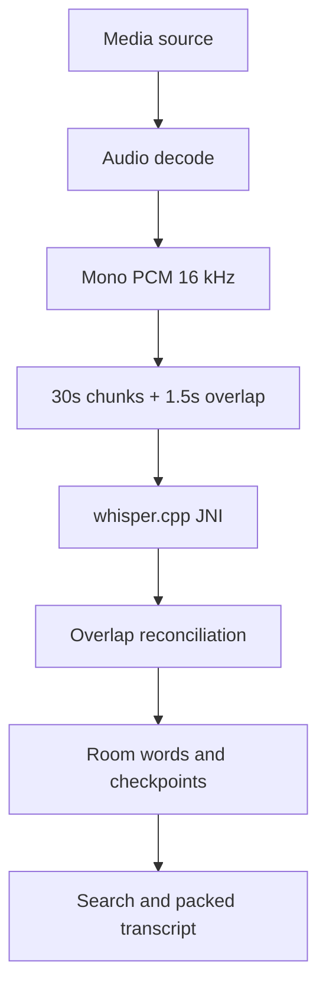

# المرحلة الرابعة — Local Speech + Transcript + Analysis Engine

## النتيجة

تضيف هذه المرحلة مسارًا محليًا غير متصل بالإنترنت لفهم صوت مصادر المشروع. لا يُمنح أي نموذج لغوي وصولًا للصوت أو الملفات؛ طبقة الكلام تنتج بيانات مصدرية يمكن لـContext Builder قراءتها لاحقًا.

## الوحدات

| الوحدة | المسؤولية |
|---|---|
| `speech-core` | عقود المزوّد، الكيانات، التقسيم، الاستئناف، البحث، الصمت، التحليل، captions والربط الزمني |
| `speech-android` | JNI/CMake وWorkManager boundary؛ تفعّل فقط عند بناء Android |
| `storage-room` schema v2 | فهارس التفريغ والكلمات والوظائف ونقاط الاستئناف وحزم النماذج |
| `third_party/whisper.cpp` | runtime أصلي مثبت على revision محدد، بترخيص MIT |

## SpeechProvider

العقد مستقل عن Whisper ويعلن صراحة قدرات word timestamps، كشف اللغة، diarization، audio events، streaming والاستئناف. `LocalWhisperProvider` هو التنفيذ الافتراضي. لا توجد Cloud ASR في هذه المرحلة.

حالات الفشل typed: مصدر بلا صوت، صوت تالف، نموذج غير مثبت/تالف، مساحة أو ذاكرة غير كافية، فشل runtime، أو إلغاء. لا تُمرر native stack traces إلى واجهة AI.

## الصوت والملفات الطويلة

- يفك Media3 مسار الصوت المختار على دفعات؛ stereo/multichannel يُمزج إلى mono ثم يعاد أخذ العينات إلى 16 kHz float PCM.
- لا يُنشأ WAV كامل. الحزم الافتراضية 30 ثانية، overlap مقدارها 1.5 ثانية.
- كل حزمة تُحفظ كـcheckpoint ذري مع النتائج الجزئية. يستأنف WorkManager من `completedChunkExclusive` بعد قتل العملية.
- reconciliation يحول أزمنة الحزمة إلى أزمنة المصدر ويهمل الكلمات التي سبق commit لها في overlap.
- الإلغاء cooperative، والموديل محمي بـlease حتى انتهاء native call؛ طلب الحذف يتحول إلى pending إذا كان مستخدمًا.

## Model Packs

الحزم Tiny/Base/Small/Medium بيانات وليست جزءًا إلزاميًا من APK. كل حزمة تحمل الحجم، RAM المتوقعة، اللغات، SHA-256، الإصدار، المصدر والترخيص. `FileModelInstaller` ينزّل إلى `.part`، يدعم range resume عبر abstraction، يتحقق من الحجم وSHA-256، ثم ينشر الملف بـatomic move. الاختيار لا يتجاوز 65% من RAM المتاحة ويخفض النموذج عند thermal severe/critical.

إدراج نموذج داخل APK يزيد حجم AAB ويجبر جميع المستخدمين على تنزيله؛ الخيار المعتمد هو dynamic/user-initiated model pack مع حزمة صغيرة اختيارية مستقبلًا.

## نموذج التفريغ والتخزين

| البيانات | التخزين |
|---|---|
| transcript header/status/fingerprint | Room `transcripts` |
| segments/words/source times/search normalization | Room، بفهرس `(transcriptId,index)` و`(sourceId,startUs)` |
| job/checkpoint/model pack state | Room |
| GGML model، downloads الجزئية، artifacts كبيرة | project/app files، paths نسبية فقط |
| packed transcript، نتائج بحث، mapping للـTimeline | محسوبة مؤقتًا وقابلة لإعادة البناء |

الكلمة تحتفظ بالنص الأصلي وبنسخة بحث normalized. التطبيع العربي يزيل التشكيل والتطويل، يوحد أشكال الألف والياء والهمزة والأرقام، ولا يغير النص المعروض. البحث يدعم exact وfuzzy محدود، مع source/time filters.

## الدقة والربط

`TimestampQuality` يميز native word عن token-derived أو aligned approximate أو segment-only. لا ندّعي دقة غير متاحة. كل كلمة مرتبطة بـ`SourceId` وزمن half-open في المصدر. `TimelineTranscriptMapper` يشتق زمنها داخل كل clip من source in وtimeline placement والسرعة الثابتة؛ منحنيات السرعة المتغيرة تتطلب mapper متكاملًا في Editor Core ولا يتم تخمينها.

تغيير fingerprint للمصدر يجعل التفريغ `STALE`. قص أو نقل clip لا يبطل التفريغ لأنه مصدرّي، بل يعيد فقط بناء mapping وcaptions المشتقة.

## التحليل المحلي

- RMS/peak/clipping/noise floor/silence ratio/speech density.
- silence ranges بسياسة threshold وminimum duration؛ نتائجها candidates وليست حذفًا تلقائيًا.
- duplicate candidates باستخدام تشابه token sets، مع تفضيل confidence فقط كإشارة أولية.
- filler candidates بقاموس عربي/إنجليزي قابل للتخصيص.
- packed transcript يجمع الكلمات حسب pause/speaker/punctuation/الحجم ويحتفظ بـword IDs.
- caption drafts: fixed words، sentence أو pause، وكل draft مرتبط بالكلمات الأصلية.

هذه النتائج metadata لتحرير المرحلة السادسة؛ لا يطبق هذا المحرك أي تعديل على Timeline.

## الحماية والاختبار

المصادر immutable، جميع paths نسبية ومحتواة، checksum إلزامي، ولا توجد shell/FFmpeg أو شبكة داخل `SpeechProvider`. اختبارات الوحدة تغطي التطبيع العربي والصمت وcaption links وsource→timeline mapping، ويغطي smoke test المسار غير المتصل.
