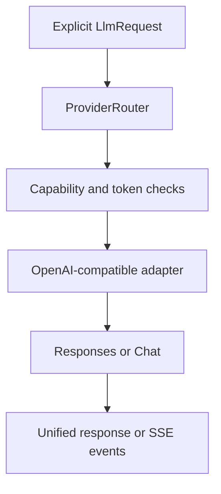

# المرحلة الخامسة — AI Provider System

## النتيجة

توفّر `ai-provider-core` واجهة واحدة مستقلة عن SDKs السحابية. لم تُبنَ محادثة التحرير ولم يُنفذ EditPlan؛ هذه الطبقة ترسل فقط `LlmRequest` الصريح الذي ينشئه المستدعي.

## العقود العامة

`LlmProvider` يعرّف model discovery، test connection، complete، streaming، structured output، tools، capabilities والإلغاء. DTOs العامة تشمل الرسائل وcontent parts والنماذج والاستخدام والأخطاء وأحداث streaming؛ لا تتسرب DTOs الخاصة بمزوّد.

الأنواع المدعومة: OpenAI وOpenRouter وHugging Face Router وNVIDIA NIM وOpenAI-compatible وCustom، مع slot صريح لـ`LocalLlmProvider`. أسماء النماذج لا تُثبت في الشيفرة، بل تأتي من `/models` أو إعداد المستخدم.

## المزودات والمسارات

`OpenAiCompatibleAdapter` هو الأساس المشترك، وتضيف adapters المنفصلة المعرفة الثابتة الأولية فقط. `ProviderDefaults` يضبط endpoints الرسمية الحالية، ويمكن للملف الشخصي تغيير `modelsPath` و`chatPath` و`responsesPath`.

`BaseUrlNormalizer` يتحقق من scheme/host، يمنع credentials/query/fragment، يوحد trailing slash، ويمنع تركيب `/v1/v1`. `RequestRouter` يفضّل Responses عندما تعلن capability ذلك ويعود إلى Chat Completions. Hugging Face/NVIDIA/Custom لا تُفترض قدراتها؛ تبقى `UNKNOWN` حتى metadata/probe/override.

## القدرات

كل capability ثلاثية الحالة `YES/NO/UNKNOWN`. `CapabilityDetector` يدمج الأدلة بالترتيب: static provider، models endpoint، model metadata، cheap probe، ثم user override. مستويات قابلية التحرير:

| المستوى | الشرط | الاستخدام اللاحق |
|---|---|---|
| A | Structured + Tools | تحرير موثوق |
| B | Structured | تحرير موثوق بلا tools |
| C | JSON mode | validator/repair |
| D | Text only/unknown | تحليل ودردشة افتراضيًا |

## Structured output وTools

`StructuredRequest<T>` يحمل schema وdecoder وvalidator. الاستراتيجية تختار JSON Schema، ثم JSON mode، ثم prompted JSON مع parser صارم؛ لا يطبق الناتج على Timeline. `ToolDefinition` يقبل JSON schema بيانات فقط ولا يقبل code. دورة tool mock مدعومة: response calls → executor آمن يملكه المستدعي → tool results → continuation.

## HTTP وStreaming

`HttpTransport` قابل للاستبدال. التنفيذ المرجعي `UrlConnectionHttpTransport` يدعم pooling الذي تديره المنصة، gzip، timeouts، request IDs، cancellation وSSE line streaming. `OpenAiSseParser` يحول النص وreasoning الاختياري والأدوات والاستخدام والنهاية إلى أحداث موحدة، ويعيد خطأ typed للحدث المشوه.

Retries محصورة في network transient و429 و5xx مع exponential backoff وjitter. لا يعاد POST ذو tool/action تلقائيًا (`idempotent=false`). `Retry-After` محترم. الأخطاء موحدة: auth، permission، URL، offline، timeout، rate limit، unavailable، model missing، context overflow، capability، structured/malformed/stream/cancelled/unknown.

## الأسرار والتخزين

- Room schema v3 يحفظ `ProviderProfile` وmodel-role assignments وdefault preference فقط.
- `apiKeyReference` مرجع مثل `keystore:providerId` وليس المفتاح.
- `AndroidKeystoreSecretStore` يستخدم AES-GCM بمفتاح غير قابل للتصدير من Android Keystore؛ ciphertext/IV فقط في app-private blob store.
- `SecretValue` يمسح buffer عند الإغلاق، و`RedactingNetworkLogger` لا يسجل body ويخفي authorization/API-key/token headers.
- migrations 1→2→3 غير مدمرة ومعلنة في `DatabaseMigrations.ALL`.

## التوجيه والخصوصية

`ProviderRouter` يرشح حسب tools/structured/vision/context/local-only/network، ثم model-role assignment والأولوية. fallback هو `OFF` أو `ASK` أو `AUTO_FOR_SAFE_TASKS`؛ المهام التنفيذية لا تبدّل نموذجها بصمت.

طبقة provider لا تستورد Project أو Timeline أو Transcript. الصور ليست سوى `ImageReference` metadata ولن يسمح caller السحابي بها قبل Privacy Policy في المرحلة السادسة. لا تُرسل ملفات أو نصوص تلقائيًا، وتعطل الشبكة لا يعطل media/speech المحليين.

## Context والتكلفة

`TokenBudgetEstimator` abstraction مع تقدير محافظ وحد context المعلن. إذا لم يلائم الطلب، يعاد `ContextTooLarge` كي يصغّر Context Builder البيانات لاحقًا. `LlmUsage` و`UsageRecord` يجهزان input/output/cached tokens والتكلفة الاختيارية بدون billing engine.

## Settings hooks

`ProviderSettingsService` يجهز add/update/delete/test/fetch models/assign role/default/read capabilities من دون UI. حذف provider يحذف سره أيضًا؛ فشل الاتصال لا يحذف الملف الشخصي.

## القيود الحالية

- لا يوجد Local LLM runtime؛ يوجد slot فقط.
- metadata الدقيقة تختلف بين endpoints، لذلك تبقى capabilities غير المثبتة `UNKNOWN`.
- live tests اختيارية مستقبلًا ولا تعمل في CI ولا تحتاج keys.
- Vision policy وContext Builder وChat Editing وEditPlan validation/execution مؤجلة للمرحلة السادسة.

المراجع الرسمية: [OpenAI API](https://platform.openai.com/docs/api-reference), [OpenRouter API](https://openrouter.ai/docs/api/reference/overview), [Hugging Face Inference Providers](https://huggingface.co/docs/inference-providers/index), [NVIDIA NIM APIs](https://docs.nvidia.com/nim/large-language-models/latest/api-reference.html), [Android Keystore](https://developer.android.com/privacy-and-security/keystore).
