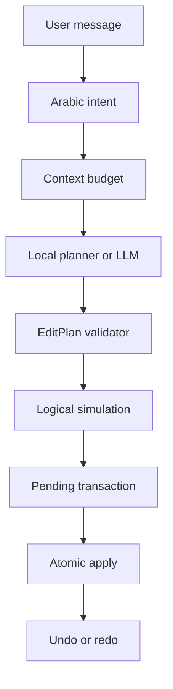

# المرحلة السادسة — AI Chat Editing + Context Builder + EditPlan Execution

## النتيجة

أضيفت وحدة `ai-editor-core` بوصفها عقل المونتاج المستقل عن UI. تستقبل الأمر، تصنفه محليًا حين يمكن، تجمع أقل سياق لازم، تولد أو تبني الخطة، تتحقق منها، تحاكيها، وتنتج `PendingEditTransaction`. لا يُعدل المصدر الخام ولا يطبق شيء قبل policy/الموافقة.

## Intent والمحادثة

`ArabicIntentClassifier` يغطي التحليل والتحرير والبحث وcaption/audio/visual/structure/export والقيود وundo/redo/explain/clarification. الأوامر الحتمية مثل «تراجع»، «لا تحذف السعر» و«احذف الصمت» لا تستدعي LLM للتصنيف. Conversation models تخزن النص الظاهر والملخصات وtool summaries وusage فقط؛ لا chain-of-thought.

Conversation memory منفصلة عن `ProjectConstraint`. القيود الدائمة تشمل preserve range/topic وaspect/duration وno music/captions والأسلوب والقفل والنص المخصص. موضوع محفوظ يمكن تحويله إلى `ProtectedRange` من البحث المحلي.

## Context Builder والأدوات

`AiContextBuilder` يختار sections بحسب intent والنص. `ContextBudgetManager` يحجز output/tool/schema overhead ولا يقطع fragment/JSON. الأولوية دائمًا للقيود والمناطق المحمية، ثم المشروع والـTimeline، ثم نتائج الاسترجاع المناسبة.

الأدوات المتاحة للـLLM قراءة فقط: project info، timeline، clip، transcript search/range/word boundaries، silence، duplicates، audio، scenes، constraints، protected ranges، history وvisual samples. `ReadOnlyToolRegistry` يرفض أي اسم غير مسجل. `BoundedToolLoop` يحد rounds/calls/timeout ويدعم cancellation.

Vision لا يخرج frames إلا عبر `VisionPermissionPolicy`: local-only أو ask each time أو provider محدد، وبشرط capability مؤكدة `YES`.

## Prompt safety

`PromptRepository` versioned (`editor-1.0.0`) ويفصل صراحة `USER_INSTRUCTION` عن `PROJECT_DATA` و`TOOL_RESULT data-only`. التفريغ محتوى غير موثوق، حتى لو احتوى «تجاهل التعليمات». لا يسجل system prompt؛ يسجل version فقط.

## EditPlan 1.1

الخطة تحمل project/sequence/base revision/title/summary/assumptions/operations/estimate/warnings/confidence/approval، وتربط revision بالخطة السابقة عند المراجعة. العمليات المدعومة تشمل trim/split/remove/move/insert/replace/speed/crop/transform/zoom/text/captions/audio/fade/color/aspect/duration target/constraints.

`ProviderEditPlanClient` يستخدم Structured Output ثم fallback الذي توفره مرحلة المزوّدات. `EditPlanJsonCodec` يحول wire milliseconds إلى microseconds الداخلية. Repair loop محدود بمحاولتين افتراضيًا ولا ينفذ خطة بقيت invalid.

## Validation والمحاكاة

`EditPlanValidator` يتحقق من المشروع والrevision والـIDs والمصادر والمدد والحد الأدنى والسرعة والتحويل والمسارات والقفل وprotected ranges وcaptions/audio والقيم البصرية. المصدر/الوقت half-open ولا يُسمح بخطة stale.

`WordSafeCutSnapper` يطبق policies: fast social/natural/cinematic/custom مع padding وtolerance. `SilenceCommandPlanner` لا يمحو كل sample صامت؛ يترك gap طبيعيًا ويحد cuts/minute. `DurationPlanner` يستخدم removable candidates ويحذر إذا استحال الهدف دون محتوى محمي. `BestTakePlanner` يرتب metadata فقط ويطلب المعاينة، و`ReelStrategyFactory` لا يخترع beats غير موجودة.

`EditSimulationEngine` يطبق العمليات على clone منطقي ويحسب duration/items/removals/moves/captions/conflicts/audio warnings/render complexity و`EditDiff`. المشروع الحقيقي لا يُمس.

## Pending / Apply / History

الحالات: proposed/simulated/ready/applied/rejected/invalid/superseded/stale. أي خطة أحدث supersede القديمة على نفس المشروع. `PendingEditCoordinator` يفحص revision مرة أخرى عند apply، ويبني transaction واحدة ثم يستدعي `AiTimelineStore.commitAtomic`.

`InMemoryAiTimelineStore` هو implementation قابل للاختبار؛ Android composition يربط العقد بمستودع Room الذري. Undo AI يعكس آخر transaction كاملة فقط إذا كانت رأس التاريخ؛ وجود manual edit بعدها يمنع القفز فوقها. Redo يعيدها. `EditDiff` يجيب «وش عدلت؟» دون LLM.

## Offline

أوامر الصمت و9:16 وأفضل Take المبنية على metadata تعمل بلا provider. البحث والتفريغ والتحرير اليدوي يبقون متاحين. المهام القصصية التي تحتاج LLM تعيد `provider_unavailable` بوضوح ولا تفسد الـTimeline.

## اختبارات المرحلة

تغطي JUnit: العربية والمختلط، context priority، protected/locked/stale، simulation immutability، atomic apply وundo/redo، silence policy، repair loop وprompt-injection boundary. Smoke test يغطي intent العربي أيضًا.

## حدود مقصودة

- ADD_CAPTIONS يحمل transcript reference؛ materialization النهائي من words يتم في Android repository وليس من نص LLM.
- Vision sampling/runtime permission يربط في UI بالمرحلة السابعة؛ لا يوجد cloud frame upload هنا.
- لا توجد مرحلة ثامنة أو تاسعة، ولا مؤثرات متقدمة أو backend.
